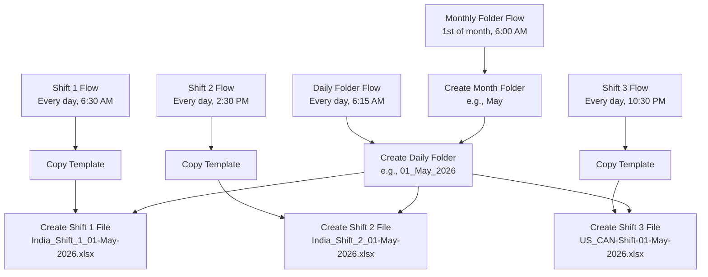

# OneDrive Shift Files Automation - Implementation Plan

## Overview
Automated system to generate shift-based Excel files in OneDrive with a hierarchical folder structure organized by month and date.

## Folder Structure Pattern
```
OneDrive Root
└── May/
    └── 01_May_2026/
        ├── India_Shift_1_01-May-2026.xlsx (Created at 6:30 AM IST)
        ├── India_Shift_2_01-May-2026.xlsx (Created at 2:30 PM IST)
        └── US_CAN-Shift-01-May-2026.xlsx (Created at 10:30 PM IST)
```

## System Architecture

### Solution: Power Automate Cloud Flows

We'll create **5 separate Power Automate flows** to handle different aspects:

1. **Monthly Folder Creator Flow** - Creates month folder (e.g., "May")
2. **Daily Folder Creator Flow** - Creates daily folder (e.g., "01_May_2026")
3. **Shift 1 File Generator Flow** - Creates Shift 1 file at 6:00 AM IST
4. **Shift 2 File Generator Flow** - Creates Shift 2 file at 2:00 PM IST
5. **Shift 3 File Generator Flow** - Creates Shift 3 file at 10:00 PM IST

### Why Multiple Flows?

- **Reliability**: Each flow handles one specific task
- **Maintainability**: Easy to troubleshoot and modify individual flows
- **Scheduling**: Different triggers for different times
- **Error Handling**: Isolated failure points

## Prerequisites

### 1. OneDrive Setup
- OneDrive for Business account (part of Microsoft 365)
- Sufficient storage space
- Appropriate permissions for the automation account

### 2. Master Template File
- Create a master Excel template file with:
  - Pre-formatted headers
  - Formulas and calculations
  - Styling and formatting
  - Any required sheets/tabs
- Store in OneDrive at: `/Templates/Shift_Template.xlsx`

### 3. Power Automate License
- Power Automate Premium license (for scheduled flows)
- Or Microsoft 365 license with Power Automate included

## Implementation Steps

### Step 1: Create Master Template File

**Location**: `/Templates/Shift_Template.xlsx` in OneDrive

**Template Structure**:
```
Sheet 1: Shift Data
- Headers: Date, Shift, Employee Name, Task, Status, Comments
- Pre-formatted cells with data validation
- Formulas for calculations (if needed)
- Conditional formatting rules

Sheet 2: Summary (optional)
- Aggregate data formulas
- Charts/graphs
```

### Step 2: Set Up Base Folder Structure

Manually create the initial structure in OneDrive:
```
/Shift_Files/
  └── Templates/
      └── Shift_Template.xlsx
```

The automation will create month and daily folders automatically.

### Step 3: Build Monthly Folder Creator Flow

**Flow Name**: `Create Monthly Shift Folder`

**Trigger**: Recurrence
- Frequency: Month
- Run on: 1st day of each month
- Time: 6:00 AM IST (UTC+5:30)

**Actions**:

1. **Initialize Variable - Month Name**
   - Name: `varMonthName`
   - Type: String
   - Value: `formatDateTime(utcNow(), 'MMMM')`

2. **Initialize Variable - Folder Path**
   - Name: `varMonthFolderPath`
   - Type: String
   - Value: `/Shift_Files/@{variables('varMonthName')}`

3. **Condition - Check if Folder Exists**
   - Get folder metadata using OneDrive connector
   - If folder doesn't exist, proceed to create

4. **Create Folder (OneDrive)**
   - Folder Path: `/Shift_Files`
   - Folder Name: `@{variables('varMonthName')}`

5. **Send Success Notification** (optional)
   - Email or Teams message confirming folder creation

**Error Handling**:
- Configure run after settings to handle folder already exists error
- Add try-catch with Scope actions

### Step 4: Build Daily Folder Creator Flow

**Flow Name**: `Create Daily Shift Folder`

**Trigger**: Recurrence
- Frequency: Day
- Run at: 6:15 AM IST (UTC+5:30)
- Time zone: India Standard Time

**Actions**:

1. **Initialize Variable - Month Name**
   - Name: `varMonthName`
   - Type: String
   - Value: `formatDateTime(convertFromUtc(utcNow(), 'India Standard Time'), 'MMMM')`

2. **Initialize Variable - Day**
   - Name: `varDay`
   - Type: String
   - Value: `formatDateTime(convertFromUtc(utcNow(), 'India Standard Time'), 'dd')`

3. **Initialize Variable - Daily Folder Name**
   - Name: `varDailyFolderName`
   - Type: String
   - Value: `@{variables('varDay')}_@{variables('varMonthName')}_@{formatDateTime(convertFromUtc(utcNow(), 'India Standard Time'), 'yyyy')}`
   - Example output: `01_May_2026`

4. **Initialize Variable - Full Path**
   - Name: `varFullPath`
   - Type: String
   - Value: `/Shift_Files/@{variables('varMonthName')}/@{variables('varDailyFolderName')}`

5. **Condition - Check if Monthly Folder Exists**
   - If not exists, create monthly folder first

6. **Create Daily Folder (OneDrive)**
   - Folder Path: `/Shift_Files/@{variables('varMonthName')}`
   - Folder Name: `@{variables('varDailyFolderName')}`

7. **Send Success Notification** (optional)

**Error Handling**:
- Handle folder already exists scenario
- Retry logic for transient failures

### Step 5: Build Shift 1 File Generator Flow

**Flow Name**: `Generate Shift 1 File`

**Trigger**: Recurrence
- Frequency: Day
- Run at: 6:30 AM IST (UTC+5:30)
- Time zone: India Standard Time

**Actions**:

1. **Initialize Variables** (same as Daily Folder flow)
   - `varMonthName`: Current month name
   - `varDay`: Current day (dd format)
   - `varDailyFolderName`: `DD_Month_YYYY` format
   - `varYear`: Current year

2. **Initialize Variable - Date String**
   - Name: `varDateString`
   - Type: String
   - Value: `formatDateTime(convertFromUtc(utcNow(), 'India Standard Time'), 'dd-MMM-yyyy')`
   - Example: `01-May-2026`

3. **Initialize Variable - File Name**
   - Name: `varFileName`
   - Type: String
   - Value: `India_Shift_1_@{variables('varDateString')}.xlsx`
   - Example: `India_Shift_1_01-May-2026.xlsx`

4. **Initialize Variable - Destination Path**
   - Name: `varDestPath`
   - Type: String
   - Value: `/Shift_Files/@{variables('varMonthName')}/@{variables('varDailyFolderName')}`

5. **Get Template File Content (OneDrive)**
   - File Path: `/Shift_Files/Templates/Shift_Template.xlsx`
   - Action: Get file content

6. **Condition - Check if Daily Folder Exists**
   - Get folder metadata
   - If not exists, create it (call Daily Folder flow or create inline)

7. **Copy File (OneDrive)**
   - Source: Template file content from step 5
   - Destination: `@{variables('varDestPath')}/@{variables('varFileName')}`
   - Method: Create file with content

8. **Update File Properties** (optional)
   - Add metadata like Shift Number, Creation Time, etc.

9. **Send Success Notification** (optional)
   - Email to shift manager
   - Teams notification

**Error Handling**:
- Check if file already exists (prevent duplicates)
- Retry logic for OneDrive API failures
- Alert on failure

### Step 6: Build Shift 2 File Generator Flow

**Flow Name**: `Generate Shift 2 File`

**Configuration**: Same as Shift 1 flow with these changes:

**Trigger**:
- Run at: 2:30 PM IST (14:30 IST)

**File Name Variable**:
- Value: `India_Shift_2_@{variables('varDateString')}.xlsx`

All other logic remains identical to Shift 1 flow.

### Step 7: Build Shift 3 File Generator Flow

**Flow Name**: `Generate Shift 3 File`

**Configuration**: Same as Shift 1 flow with these changes:

**Trigger**:
- Run at: 10:30 PM IST (22:30 IST)

**File Name Variable**:
- Value: `US_CAN-Shift-@{variables('varDateString')}.xlsx`

All other logic remains identical to Shift 1 flow.

## Power Automate Flow Diagram



## Key Power Automate Expressions

### Date and Time Formatting

**Get Current Time in IST**:
```
convertFromUtc(utcNow(), 'India Standard Time')
```

**Format Month Name**:
```
formatDateTime(convertFromUtc(utcNow(), 'India Standard Time'), 'MMMM')
```

**Format Day (01, 02, etc.)**:
```
formatDateTime(convertFromUtc(utcNow(), 'India Standard Time'), 'dd')
```

**Format Year**:
```
formatDateTime(convertFromUtc(utcNow(), 'India Standard Time'), 'yyyy')
```

**Format Date String (01-May-2026)**:
```
formatDateTime(convertFromUtc(utcNow(), 'India Standard Time'), 'dd-MMM-yyyy')
```

### Folder Path Construction

**Monthly Folder Path**:
```
/Shift_Files/@{formatDateTime(convertFromUtc(utcNow(), 'India Standard Time'), 'MMMM')}
```

**Daily Folder Name**:
```
@{formatDateTime(convertFromUtc(utcNow(), 'India Standard Time'), 'dd')}_@{formatDateTime(convertFromUtc(utcNow(), 'India Standard Time'), 'MMMM')}_@{formatDateTime(convertFromUtc(utcNow(), 'India Standard Time'), 'yyyy')}
```

**Full Daily Folder Path**:
```
/Shift_Files/@{formatDateTime(convertFromUtc(utcNow(), 'India Standard Time'), 'MMMM')}/@{formatDateTime(convertFromUtc(utcNow(), 'India Standard Time'), 'dd')}_@{formatDateTime(convertFromUtc(utcNow(), 'India Standard Time'), 'MMMM')}_@{formatDateTime(convertFromUtc(utcNow(), 'India Standard Time'), 'yyyy')}
```

### File Name Construction

**Shift 1 File Name**:
```
India_Shift_1_@{formatDateTime(convertFromUtc(utcNow(), 'India Standard Time'), 'dd-MMM-yyyy')}.xlsx
```

**Shift 2 File Name**:
```
India_Shift_2_@{formatDateTime(convertFromUtc(utcNow(), 'India Standard Time'), 'dd-MMM-yyyy')}.xlsx
```

**Shift 3 File Name**:
```
US_CAN-Shift-@{formatDateTime(convertFromUtc(utcNow(), 'India Standard Time'), 'dd-MMM-yyyy')}.xlsx
```

## Testing Strategy

### Phase 1: Manual Testing

1. **Test Monthly Folder Creation**
   - Manually trigger the monthly folder flow
   - Verify folder created with correct name
   - Check for duplicate handling

2. **Test Daily Folder Creation**
   - Manually trigger the daily folder flow
   - Verify nested folder structure
   - Test with existing monthly folder

3. **Test Each Shift File Generation**
   - Manually trigger each shift flow
   - Verify file copied from template
   - Check file naming convention
   - Confirm formulas and formatting preserved

### Phase 2: Automated Testing

1. **Run for 3 consecutive days**
   - Monitor all flows
   - Check for any failures
   - Verify file creation times

2. **Test Month Transition**
   - Test on last day of month
   - Verify new month folder created
   - Check daily folder in new month

3. **Test Error Scenarios**
   - Template file missing
   - Insufficient permissions
   - OneDrive connectivity issues

## Monitoring and Maintenance

### Flow Run History

Monitor in Power Automate portal:
- Flow run success/failure rates
- Execution duration
- Error messages and details

### Alerts and Notifications

Set up alerts for:
- Flow failures (email to admin)
- Consecutive failures (escalate to team)
- Template file modifications
- Storage quota warnings

### Regular Maintenance Tasks

**Weekly**:
- Review flow run history
- Check for any failed runs
- Verify file creation consistency

**Monthly**:
- Audit folder structure
- Clean up old files (if retention policy exists)
- Review and update template file
- Check OneDrive storage usage

**Quarterly**:
- Review and optimize flow performance
- Update documentation
- Test disaster recovery procedures

## Troubleshooting Guide

### Issue 1: Flow Not Triggering at Scheduled Time

**Symptoms**: Flow doesn't run at expected time

**Possible Causes**:
- Time zone misconfiguration
- Flow disabled
- License issues

**Solutions**:
1. Check flow status (enabled/disabled)
2. Verify time zone setting in trigger
3. Check Power Automate license status
4. Review flow run history for errors

### Issue 2: Folder Already Exists Error

**Symptoms**: Flow fails with "folder already exists" error

**Possible Causes**:
- Flow ran multiple times
- Manual folder creation
- Previous run didn't complete

**Solutions**:
1. Add condition to check folder existence before creation
2. Configure "Run After" settings to continue on error
3. Use "Get folder metadata" action with error handling

### Issue 3: Template File Not Found

**Symptoms**: File generation fails, template not accessible

**Possible Causes**:
- Template moved or deleted
- Permission issues
- OneDrive sync problems

**Solutions**:
1. Verify template file exists at specified path
2. Check file permissions
3. Re-upload template file
4. Update file path in flows

### Issue 4: Files Created with Wrong Date

**Symptoms**: File names have incorrect dates

**Possible Causes**:
- Time zone conversion issues
- UTC vs IST confusion
- Expression errors

**Solutions**:
1. Use `convertFromUtc()` function consistently
2. Verify time zone: `India Standard Time`
3. Test expressions in flow checker
4. Add logging to debug date values

### Issue 5: Duplicate Files Created

**Symptoms**: Multiple files for same shift on same day

**Possible Causes**:
- Flow triggered multiple times
- Manual re-runs
- No duplicate check

**Solutions**:
1. Add condition to check if file exists
2. Use unique identifiers in file names
3. Implement file existence check before creation
4. Review flow trigger history

## Security and Permissions

### OneDrive Permissions

**Required Permissions**:
- Read/Write access to `/Shift_Files` folder
- Read access to `/Templates` folder
- Folder creation permissions

**Best Practices**:
- Use service account for automation
- Apply principle of least privilege
- Regular permission audits
- Enable audit logging

### Power Automate Connections

**Connection Security**:
- Use organizational account
- Enable MFA for automation account
- Regular connection review
- Monitor connection usage

## Cost Considerations

### Power Automate Licensing

**Options**:
1. **Microsoft 365 License**: Includes Power Automate (limited runs)
2. **Power Automate Premium**: Unlimited runs, premium connectors
3. **Power Automate Per Flow**: Pay per flow

**Estimated Runs**:
- Monthly Folder: 12 runs/year
- Daily Folder: 365 runs/year
- Shift Files: 1,095 runs/year (3 shifts × 365 days)
- **Total**: ~1,472 runs/year

### OneDrive Storage

**Estimated Storage**:
- Template file: ~50 KB
- Each shift file: ~50 KB
- Daily files: 150 KB (3 shifts)
- Monthly: ~4.5 MB (30 days)
- Yearly: ~54 MB

**Storage Planning**:
- Implement retention policy
- Archive old files
- Compress historical data

## Alternative Approaches

### Option 1: Single Consolidated Flow

**Pros**:
- Fewer flows to manage
- Centralized logic

**Cons**:
- Complex scheduling logic
- Harder to troubleshoot
- Single point of failure

### Option 2: Azure Logic Apps

**Pros**:
- More advanced features
- Better for enterprise scale
- Enhanced monitoring

**Cons**:
- Higher cost
- More complex setup
- Requires Azure subscription

### Option 3: PowerShell Script + Task Scheduler

**Pros**:
- More control
- No licensing costs
- Offline capability

**Cons**:
- Requires dedicated server
- Manual maintenance
- No cloud integration

### Option 4: Python Script + Azure Functions

**Pros**:
- Highly customizable
- Serverless architecture
- Cost-effective at scale

**Cons**:
- Requires coding expertise
- More setup complexity
- Additional Azure services

## Recommended Approach

**Primary Solution**: Power Automate (as described in this plan)

**Reasons**:
1. Native OneDrive integration
2. No coding required
3. Built-in scheduling
4. Easy maintenance
5. Visual workflow designer
6. Good monitoring tools
7. Suitable for business users

## Next Steps

1. **Review and approve this plan**
2. **Prepare OneDrive environment**
   - Create folder structure
   - Upload template file
   - Set permissions
3. **Create Power Automate flows**
   - Start with monthly folder flow
   - Then daily folder flow
   - Finally, shift file flows
4. **Test thoroughly**
   - Manual testing first
   - Then automated testing
5. **Deploy to production**
   - Enable all flows
   - Monitor for first week
6. **Document and train**
   - User documentation
   - Admin procedures
   - Troubleshooting guide

## Support and Resources

### Microsoft Documentation
- [Power Automate Documentation](https://docs.microsoft.com/power-automate/)
- [OneDrive Connector Reference](https://docs.microsoft.com/connectors/onedrive/)
- [Expression Functions](https://docs.microsoft.com/power-automate/use-expressions-in-conditions)

### Community Resources
- Power Automate Community Forums
- Microsoft Tech Community
- YouTube tutorials

### Training Resources
- Microsoft Learn: Power Automate modules
- LinkedIn Learning courses
- Udemy Power Automate courses

## Conclusion

This automated system will reliably generate shift files in OneDrive following your specified folder structure and naming conventions. The Power Automate approach provides a balance of functionality, ease of use, and maintainability suitable for business users.

The modular design with separate flows for each task ensures reliability and makes troubleshooting straightforward. With proper testing and monitoring, this system will run smoothly with minimal maintenance required.