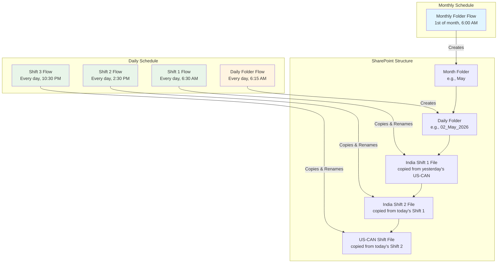
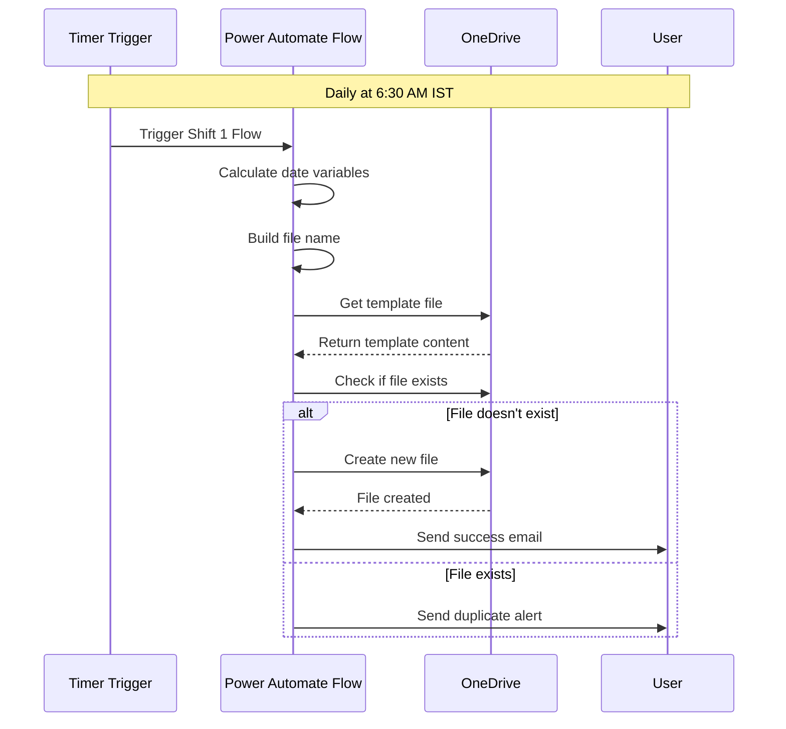
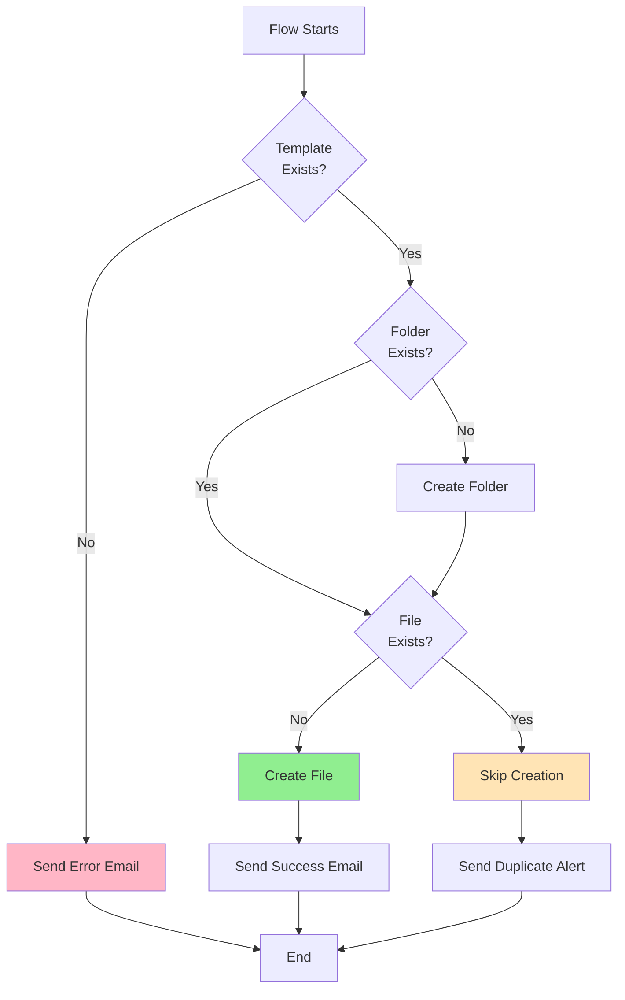

# Quick Reference Guide - Shift Files Automation

## System Overview

This automated system creates shift-based Excel files in SharePoint using a **chain-copy workflow** with a hierarchical folder structure organized by month and date.

**Key Concept**: Each shift file is created by copying and renaming the previous shift's file, maintaining data continuity.

## Folder Structure

```
SharePoint/Daily Handover/
├── May/                        (Created monthly at 6:00 AM)
│   ├── 01_May_2026/            (Created daily at 6:15 AM)
│   │   └── US_CAN-Shift-01-May-2026.xlsx (Initial file - manual)
│   │
│   ├── 02_May_2026/            (Created daily at 6:15 AM)
│   │   ├── India_Shift_1_02-May-2026.xlsx (6:30 AM - copied from US_CAN-Shift-01-May-2026.xlsx)
│   │   ├── India_Shift_2_02-May-2026.xlsx (2:30 PM - copied from India_Shift_1_02-May-2026.xlsx)
│   │   └── US_CAN-Shift-02-May-2026.xlsx (10:30 PM - copied from India_Shift_2_02-May-2026.xlsx)
│   │
│   ├── 03_May_2026/
│   │   ├── India_Shift_1_03-May-2026.xlsx (copied from US_CAN-Shift-02-May-2026.xlsx)
│   │   └── ... (continues)
│   │
│   └── 04_May_2026/
│       └── ... (continues daily)
│
└── June/                       (Created on June 1st at 6:00 AM)
    └── 01_June_2026/
        └── ... (continues)
```

## Chain-Copy Flow

```
Day 1: US_CAN-Shift-01-May-2026.xlsx (manual)
         ↓
Day 2: 6:30 AM  → India_Shift_1_02-May-2026.xlsx
         ↓
       2:30 PM  → India_Shift_2_02-May-2026.xlsx
         ↓
       10:30 PM → US_CAN-Shift-02-May-2026.xlsx
         ↓
Day 3: 6:30 AM  → India_Shift_1_03-May-2026.xlsx
       (continues...)
```

## Daily Timeline

```mermaid
gantt
    title Daily Shift File Creation Timeline
    dateFormat HH:mm
    axisFormat %H:%M
    
    section Folder Setup
    Create Daily Folder    :milestone, m1, 06:15, 0m
    
    section Shift 1
    Create Shift 1 File    :milestone, m2, 06:30, 0m
    
    section Shift 2
    Create Shift 2 File    :milestone, m3, 14:30, 0m
    
    section Shift 3
    Create Shift 3 File    :milestone, m4, 22:30, 0m
```



## Flow Architecture



## Flow Details

### Flow 1: Monthly Folder Creator
- **Trigger**: 1st of each month at 6:00 AM IST
- **Purpose**: Creates month folder (e.g., "May")
- **Platform**: SharePoint
- **Output**: `/Daily Handover/May/`

### Flow 2: Daily Folder Creator
- **Trigger**: Every day at 6:15 AM IST
- **Purpose**: Creates daily folder with format `DD_Month_YYYY`
- **Platform**: SharePoint
- **Output**: `/Daily Handover/May/02_May_2026/`

### Flow 3: India Shift 1 File Generator
- **Trigger**: Every day at 6:30 AM IST
- **Purpose**: Copies yesterday's US-CAN file and renames to India Shift 1
- **Source**: `US_CAN-Shift-01-May-2026.xlsx` (from yesterday)
- **Output**: `India_Shift_1_02-May-2026.xlsx` (today)

### Flow 4: India Shift 2 File Generator
- **Trigger**: Every day at 2:30 PM IST
- **Purpose**: Copies today's India Shift 1 file and renames to India Shift 2
- **Source**: `India_Shift_1_02-May-2026.xlsx` (from today)
- **Output**: `India_Shift_2_02-May-2026.xlsx` (today)

### Flow 5: US-Canada Shift File Generator
- **Trigger**: Every day at 10:30 PM IST
- **Purpose**: Copies today's India Shift 2 file and renames to US-CAN
- **Source**: `India_Shift_2_02-May-2026.xlsx` (from today)
- **Output**: `US_CAN-Shift-02-May-2026.xlsx` (today)

## File Naming Convention

```
India Shifts Format: India_Shift_{ShiftNumber}_{Date}.xlsx
US-Canada Shift Format: US_CAN-Shift-{Date}.xlsx

Examples:
- India_Shift_1_01-May-2026.xlsx
- India_Shift_2_15-May-2026.xlsx
- US_CAN-Shift-30-June-2026.xlsx
```

## Folder Naming Convention

```
Monthly Folder: {MonthName}
Example: May, June, July

Daily Folder: {DD}_{MonthName}_{YYYY}
Example: 01_May_2026, 15_June_2026
```

## Power Automate Expressions Cheat Sheet

### Get Current Time in IST
```
convertFromUtc(utcNow(), 'India Standard Time')
```

### Format Month Name
```
formatDateTime(convertFromUtc(utcNow(), 'India Standard Time'), 'MMMM')
```
Output: `May`

### Format Day (with leading zero)
```
formatDateTime(convertFromUtc(utcNow(), 'India Standard Time'), 'dd')
```
Output: `01`

### Format Year
```
formatDateTime(convertFromUtc(utcNow(), 'India Standard Time'), 'yyyy')
```
Output: `2026`

### Format Date String
```
formatDateTime(convertFromUtc(utcNow(), 'India Standard Time'), 'dd-MMM-yyyy')
```
Output: `01-May-2026`

### Build Daily Folder Name
```
@{variables('varDay')}_@{variables('varMonthName')}_@{variables('varYear')}
```
Output: `01_May_2026`

### Build Source File Name (Yesterday's US-CAN for Shift 1)
```
US_CAN-Shift-@{variables('varYesterdayDateString')}.xlsx
```
Output: `US_CAN-Shift-01-May-2026.xlsx`

### Build New File Name (Today's India Shift 1)
```
India_Shift_1_@{variables('varDateString')}.xlsx
```
Output: `India_Shift_1_02-May-2026.xlsx`

### Build Source Path (Yesterday's folder)
```
/OC HANDOVER CIBC INTRIA/Daily Handover/@{variables('varYesterdayMonth')}/@{variables('varYesterdayFolderName')}/@{variables('varSourceFileName')}
```

### Build Destination Path (Today's folder)
```
/OC HANDOVER CIBC INTRIA/Daily Handover/@{variables('varMonthName')}/@{variables('varDailyFolderName')}
```

## Common Tasks

### Check Flow Status
1. Go to [Power Automate Portal](https://make.powerautomate.com)
2. Click **My flows**
3. Check status indicator (green = enabled, gray = disabled)

### View Flow Run History
1. Open the flow
2. Click **Run history** tab
3. Review success/failure status
4. Click on a run to see details

### Manually Trigger a Flow
1. Open the flow
2. Click **Test** button
3. Select **Manually**
4. Click **Run flow**

### Enable/Disable a Flow
1. Open the flow
2. Click the toggle switch at top right
3. Confirm the action

### Edit a Flow
1. Open the flow
2. Click **Edit** button
3. Make changes
4. Click **Save**

## Troubleshooting Quick Fixes

### Flow Not Running
- ✅ Check if flow is enabled
- ✅ Verify time zone setting
- ✅ Check license status
- ✅ Review trigger configuration

### Wrong Date/Time
- ✅ Use `convertFromUtc()` function
- ✅ Set time zone to 'India Standard Time'
- ✅ Test expressions in flow checker

### File Not Created
- ✅ Verify template file exists
- ✅ Check folder path is correct
- ✅ Review flow run history
- ✅ Verify OneDrive permissions

### Duplicate Files
- ✅ Check file existence condition
- ✅ Review trigger history
- ✅ Ensure single instance running

## Monitoring Dashboard

### Daily Checks
- [ ] Review flow run history
- [ ] Check for any failures
- [ ] Verify files created on time

### Weekly Checks
- [ ] Audit all flow runs
- [ ] Verify file consistency
- [ ] Check storage usage
- [ ] Review error logs

### Monthly Checks
- [ ] Audit folder structure
- [ ] Update template if needed
- [ ] Review and optimize flows
- [ ] Check license usage

## File Creation Process Flow



## Error Handling Flow



## Key Contacts

| Role | Contact | Purpose |
|------|---------|---------|
| Power Automate Admin | admin@company.com | Flow issues, permissions |
| SharePoint Admin | sharepoint-admin@company.com | Storage, access issues |
| Shift Manager | shift-manager@company.com | File content, data issues |
| IT Support | it-support@company.com | Technical issues |

## Important Links

- [Power Automate Portal](https://make.powerautomate.com)
- [SharePoint Site](https://ibm-my.sharepoint.com/personal/b_vignesh19_ibm_com)
- [Power Automate Documentation](https://docs.microsoft.com/power-automate/)
- [SharePoint Connector Reference](https://docs.microsoft.com/connectors/sharepointonline/)
- [SharePoint Chain-Copy Workflow Guide](SharePoint_Chain_Copy_Workflow_Guide.md) ⭐

## Monthly Maintenance Checklist

### First Week of Month
- [ ] Verify new month folder created
- [ ] Check all flows running correctly
- [ ] Review previous month's files
- [ ] Archive old files if needed

### Mid-Month
- [ ] Review flow performance
- [ ] Check storage usage
- [ ] Update template if needed
- [ ] Test backup procedures

### End of Month
- [ ] Prepare for month transition
- [ ] Review all flow runs
- [ ] Document any issues
- [ ] Plan improvements

## Success Metrics

### Daily
- ✅ 3 files created per day via chain-copy
- ✅ Files created on time (±5 minutes)
- ✅ Data continuity maintained across shifts
- ✅ Proper file naming and organization

### Weekly
- ✅ 21 files created (7 days × 3 shifts)
- ✅ 100% success rate
- ✅ No manual interventions needed

### Monthly
- ✅ ~90 files created (30 days × 3 shifts)
- ✅ Proper folder structure maintained
- ✅ All flows running smoothly
- ✅ Chain-copy workflow functioning correctly
- ✅ Storage within limits

## Quick Start Guide

### For New Users

1. **Access SharePoint**
   - Go to SharePoint site
   - Navigate to `/Daily Handover/`

2. **Find Today's Files**
   - Open current month folder (e.g., `May`)
   - Open today's folder (e.g., `06_May_2026`)
   - Files are named by shift (India_Shift_1, India_Shift_2, US_CAN-Shift)

3. **Use the Files**
   - Open the appropriate shift file
   - Data from previous shift is already there
   - Update with new information
   - Save when done

### For Administrators

1. **Monitor Flows**
   - Check Power Automate portal daily
   - Review run history
   - Address any failures immediately

2. **Monitor Chain-Copy**
   - Verify each file copies correctly
   - Check data continuity
   - Monitor for month transitions

3. **Manage Storage**
   - Monitor OneDrive usage
   - Archive old files
   - Implement retention policy

## Version History

| Version | Date | Changes |
|---------|------|---------|
| 1.0 | May 2026 | Initial implementation - template approach |
| 2.0 | May 6, 2026 | Updated for SharePoint chain-copy workflow |

---

**Last Updated**: May 2, 2026  
**Document Owner**: IT Team  
**Review Frequency**: Quarterly